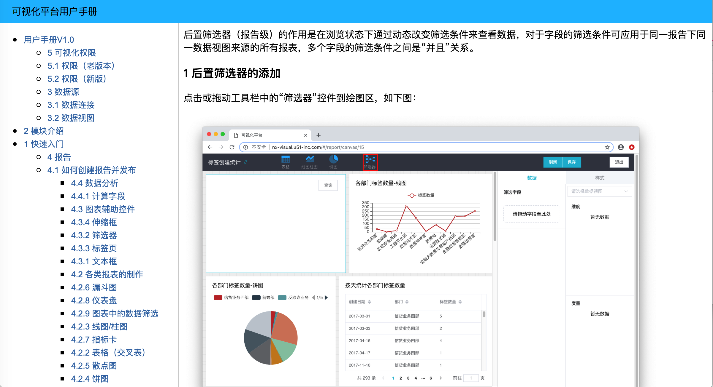

# confluenceCrawler

一个命令行导出Atlassian confluence文档树。

### 解决问题
- confluence文档没法按目录树批量导出

### 环境依赖:
- `node ^10.15.0`
- `npm ^6.4.0`

### 使用方法
1. `git clone` 或 download repo.
1. `npm install`
1. 在config.js中输入wiki地址、登陆wiki使用的用户名和密码，如：
    ```javascript
    const config = {
      wikiUrl: 'http://wiki.solos.com',
      user: 'xxx',
      password: 'xxx',
    };
    ```
1. `npm start [confluence根文章id] [文档名]`

	会以id为根目录, 导出根目录以下的结构和文章

	例如: `npm start 741256 Doc-1.0` 会导出 id=741256 下的所有子文章
1. 导出的静态文档在`./build`中, 可以打开`index.html`查看文档.

### 注意事项
- 目前不支持图片和代码之外的macro格式 (例如macro目录)

### 最后
- 任何问题请Issues.

### Demo

