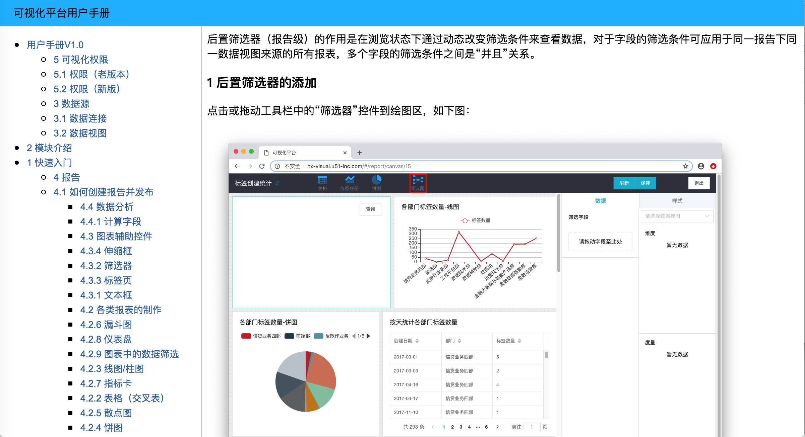

# ConfluenceCrawler
[中文文档](https://github.com/shaqueoneal/comfluence-crawler/blob/master/README-zh.md)

Export the Atlassian confluence document tree in one command.

### Problem solving
- The confluence document cannot be exported in batch according to the directory tree

### Environmental dependence:
- `node ^10.15.0`
- `npm ^6.4.0`

### How to use
1. ` git clone 'or download repo
1. `npm install`
1. In config.js, enter the wiki address, user name and password to log in to wiki, such as:
    ```javascript
    const config = {
      wikiUrl: 'http://wiki.solos.com',
      user:'xxx',
      password: 'xxx',
    }
    ```
1. `npm start [confluence root article ID] [document name]`  
    The structure and articles under the root directory will be exported with ID as the root directory  
    For example: `npm start 741256 Doc-1.0` will export all sub articles with id = 741256
1. In `./build`, you can open `index.html` to view the exported static document

### Precautions
- Currently, macro formats other than pictures and codes (such as macro directory) 

### Demo

